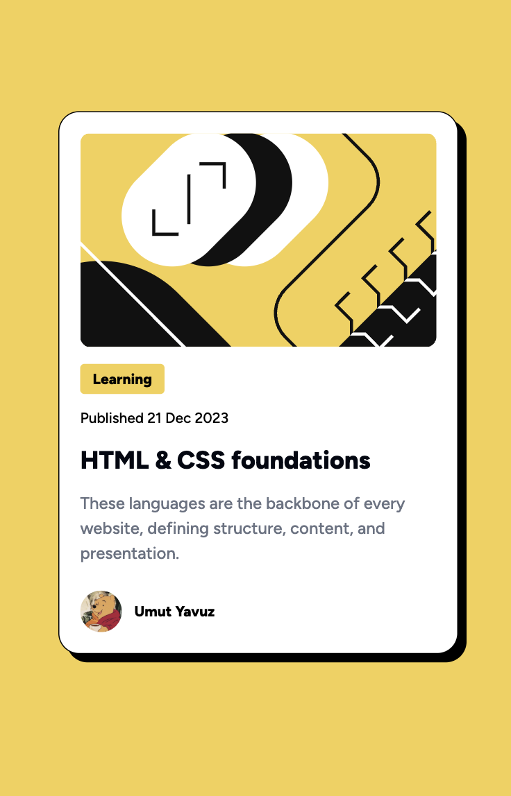

# Frontend Mentor - Blog Preview Card

This is my solution to the [Blog Preview Card challenge on Frontend Mentor](https://www.frontendmentor.io/challenges/blog-preview-card-ckPaj01IcS).  
It was built using **React** and **Tailwind CSS**. The goal was to create a responsive blog preview card component with an image, title, description, and author info.

---

## 🔗 Live Site

👉 [Live preview here](https://umutyavyz.github.io/frontendmentor-blog-preview-card/)

---

## 📸 Screenshot

---

## 🛠️ Technologies Used

- HTML5
- React + Vite
- Tailwind CSS
- Git & GitHub
- [Frontend Mentor](https://www.frontendmentor.io/)

---

## 💡 What I Learned

- Creating a responsive card layout with Tailwind CSS  
- Handling images and text content for a blog preview  
- Applying hover effects and transitions  
- Structuring React components for small UI modules

---

## 🧩 Useful Resources

- [Tailwind CSS Documentation](https://tailwindcss.com/docs)  
- [Frontend Mentor Challenges](https://www.frontendmentor.io/challenges)  

---

## ✍️ Author

- GitHub: [@umutyavyz](https://github.com/umutyavyz)  
- Frontend Mentor: [@umutyavyz](https://www.frontendmentor.io/profile/umutyavyz)  

---

## 📜 License

This project is open source and available under the [MIT License](LICENSE).
